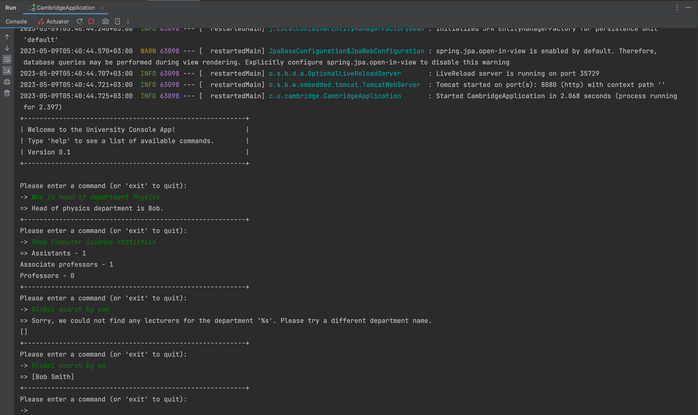
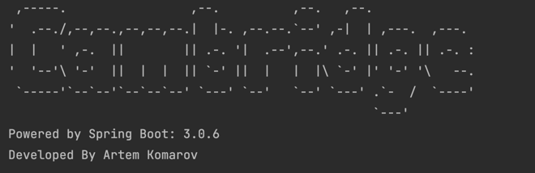

# University CLI

This Spring Boot Java project with console interface can be used by universities to manage their departments and
lectors. With the ability to store all data in a relational database, it allows for easy access to the information. The
app enables users to execute various commands in terminal.

### Nice to have

- Java 17
- PostgreSQL
- Spring 3 🌱
- Docker (To init database)

### Features

- The application uses strategy design pattern for the console commands ✅
- Commands can be written in any cases with any spaces. ✅

Advantage of usage strategy design pattern in this project: By using the strategy pattern, we can encapsulate each
algorithm or strategy in a separate class and then dynamically choose the appropriate strategy at runtime based on the
user input or other factors. This can help make the application more flexible and easier to maintain, as we can add or
modify strategies without changing the main code.

### How to run

To get started you need to have Docker installed on your machine

Then, we need to run .yaml file, you can not only directly open them in IDE, but also in terminal with the following
program.

```bash
  docker-compose -f docker-compose-pg.yml up
```

## 🚀 Run it

That's all, you need to run Application class in your IDE.

```java

@SpringBootApplication
public class CambridgeApplication {
    //...
}
```

### Tests

```
+---------------------------------------------------------+ 
| Welcome to the University Console App!                  | 
| Type 'help' to see a list of available commands.        | 
| Version 0.1                                             | 
+---------------------------------------------------------+ 

Please enter a command (or 'exit' to quit): 
-> Who is head of department Physics
=> Head of physics department is Bob.
+---------------------------------------------------------+
Please enter a command (or 'exit' to quit): 
-> Global search by h
=> [John Doe, Bob Smith, Emily Chen, Samantha Johnson, Chris Wilson]
+---------------------------------------------------------+
Please enter a command (or 'exit' to quit): 
-> Global search by bo
=> [Bob Smith]
+---------------------------------------------------------+
Please enter a command (or 'exit' to quit): 
-> Global search by hdsaq
=> []
+---------------------------------------------------------+
Please enter a command (or 'exit' to quit): 
-> Show the average salary for the department History
=> The average salary of history is 12000.00
+---------------------------------------------------------+
Please enter a command (or 'exit' to quit): 
-> exit

Thank you for using the University of Cambridge console!
+---------------------------------------------------------+
```

#### Database

There are lectors in the database are scripted in database-init.sql

### Congratulations

Congratulations! You've done everything correct 🎉

### Screenshot 📷


---


